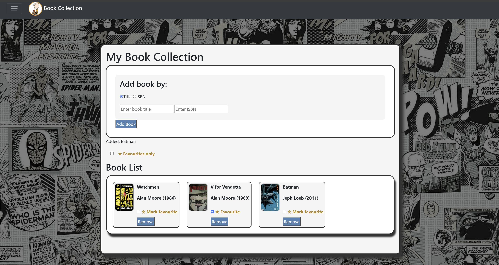
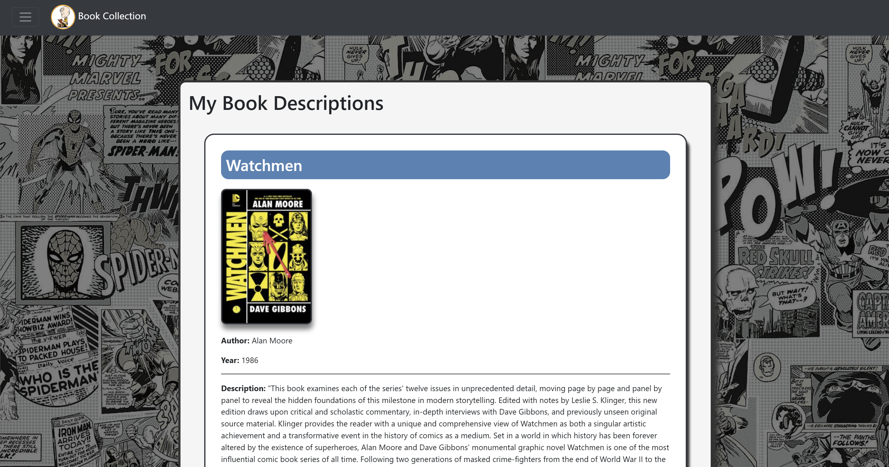

# Book Collection App

A web application built using HTML, CSS and JavaScript that allows users to search for books using the Open Library API and manage a personal book collection.

## Features

- Search books by title or ISBN
- Retrieve book information from the Open Library API
- Add books to a personal collection
- Mark books as favourites
- Dynamic user interface using JavaScript

## Technologies

- HTML
- CSS
- JavaScript
- Open Library API

## Screenshot

### Collection Management

### Book Information Page

## Project Overview

This project was developed as part of a university web development module and demonstrates the use of JavaScript, API integration, DOM manipulation and responsive web design.